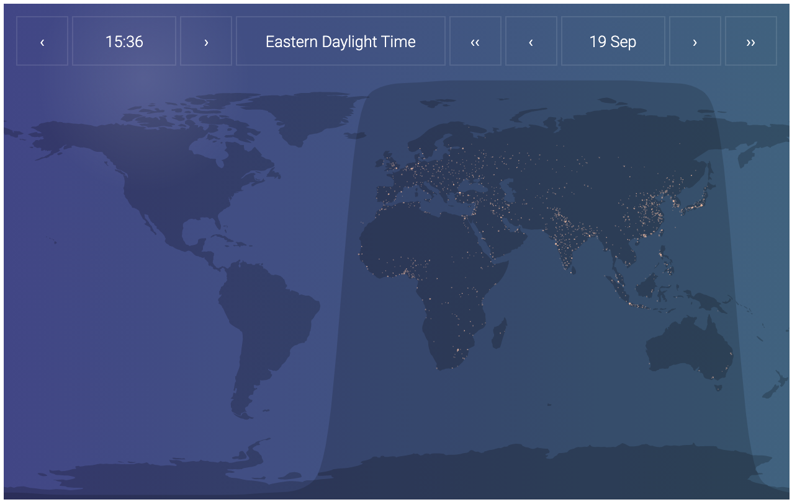

# world-daylight-map

## What's This?

A library enabling you to embed a map of the world with a daylight/night-time overlay.

<!--  -->


## Basic Usage

At the moment, this library only works as a react import. I plan to add a UMD build in the near future.

To use it in your react app:

1. Add the package to your react app:

```bash
npm i -S world-daylight-map
```

2. Import and use it in a typescript/es6 project as follows:

```tsx
import * as React from 'react';
import * as ReactDOM from 'react-dom';
import { WorldDaylightMap } from 'world-daylight-map';

const App = () => {
  return (
    <div style={{ width: '100%', height: '400px' }}>
      <WorldDaylightMap />
    </div>
  );
};

ReactDOM.render(<App />, document.getElementById('root'));
```

In an es5 project, replace the library import with `const WorldDaylightMap = require('world-daylight-map').default;`. The package has typescript types built in.

## Configuration

The `WorldDaylightMap` constructor takes an optional `options` object as prop with the default values indicated here:

```tsx
      <WorldDaylightMap
        options={
          {
            width: '100%',
            height: '100%',
            controlsPosition: 'outer-top',
            controlsScale: 1.0,
            font: "'Roboto', sans-serif",
            fontSize: null,
          }
        }
```

Notes on options:

- width/height
  - These are '100%' by default, so the WorldDaylightMap constructor can simply be placed into a parent with non-zero width/height without any further configuration. You can override these default values with a number or string (as per standard css-in-js standards; under the hood world-daylight-map uses [ MaterialUI CSS-in-JS styles](https://material-ui.com/styles/basics/).
- controlsPosition
  - Determines if/where you place the date/time controls; it takes the following values:
    - 'outer-top'
    - 'top'
    - 'top-left'
    - 'top-right'
    - 'bottom'
    - 'bottom-left'
    - 'bottom-right'
    - 'no-controls'
- controlsScale
  - Takes a value between 0 and 1, scales the size of the controls box
- font
  - Standard CSS string; you need to make the font available within your CSS setup
  - Note: this library uses Roboto as default; if you do not have Roboto available in your CSS setup then it will default to whatever the active font is for your parent container
- fontSize
  - By default, this property has value 'null', which causes the library to automatically scale your text based upon the width of the map. You can override this scaling-font size by an absolute value (number of string)

## TODOs

- Enable UMD build
- Add optional city icons
- Add demo
- Enable d3 externalization
